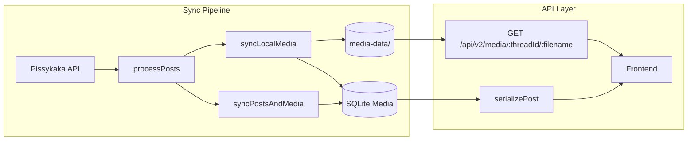
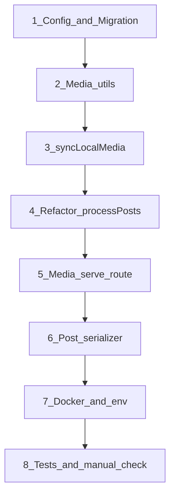

# План: локальное хранение и раздача медиа

## Контекст

Сейчас синк ([`packages/backend/src/sync/processors/processPosts.ts`](packages/backend/src/sync/processors/processPosts.ts)) собирает `mediaItems` и вызывает `syncPostsAndMedia`, который **удаляет все media-строки поста и вставляет заново** без файлов на диске ([`packages/backend/src/db/repositories/posts.ts`](packages/backend/src/db/repositories/posts.ts), строки 254–279).

API возвращает **сырые TypeORM-сущности** `Post` + `Media` без сериализации — фронт читает `urlOrigin`/`urlPreview` напрямую ([`packages/frontend/src/components/common/PostMedia/PostMedia.tsx`](packages/frontend/src/components/common/PostMedia/PostMedia.tsx)).



## Согласованные решения (из grill-me)

| Тема | Решение |
|---|---|
| Хранение | `./media-data` на backend, env `MEDIA_DATA_DIR` |
| Docker | Отдельный volume `media_data:/app/packages/backend/media-data` |
| Раздача | `GET /api/v2/media/:threadId/:filename`, публично, anti path-traversal |
| Публичный URL | env `API_PUBLIC_BASE_URL` (напр. `http://localhost:3000/api`) |
| БД | `localPath`, `localPreviewPath` в таблице `Media` |
| API для фронта | Подменять `urlOrigin`/`urlPreview`; `localPath*` не отдавать |
| YouTube | Не скачивать, оставлять внешние URL |
| Путь файла | `media-data/{threadId}/{postId}_{type}_{hash8}_{name}.{ext}` |
| threadId | ID OP-поста (`parent_id = null`) |
| hash8 | SHA-256 от `urlOrigin` / `urlPreview`, первые 8 hex |
| Имя файла | Парсинг из URL pathname + санитизация |
| Скачивание | Синхронно в синке; 404 → null; timeout/5xx → 5 ретраев (30s, пауза 2s) |
| Повторный синк | Diff по `urlOrigin`/`urlPreview`; удаление устаревших файлов |
| Бэкфилл | Через обычный синк |
| Cache-Control | `public, max-age=31536000, immutable` |

---

## 1. Конфигурация и инфраструктура

**Файлы:**
- [`packages/backend/src/utils/config.ts`](packages/backend/src/utils/config.ts) — добавить:
  - `mediaDataDir` (`MEDIA_DATA_DIR`, default `./media-data`)
  - `apiPublicBaseUrl` (`API_PUBLIC_BASE_URL`, default `http://localhost:${port}/api`)
- [`packages/backend/.env.example`](packages/backend/.env.example), [`infra/monorepo-docker/.env.example`](infra/monorepo-docker/.env.example) — документировать новые env
- [`infra/monorepo-docker/docker-compose.yml`](infra/monorepo-docker/docker-compose.yml):
  ```yaml
  volumes:
    - backend_data:/app/packages/backend/data
    - media_data:/app/packages/backend/media-data
  environment:
    MEDIA_DATA_DIR: ./media-data
    API_PUBLIC_BASE_URL: ${API_PUBLIC_BASE_URL:-http://localhost:3000/api}
  volumes:
    media_data:
  ```

---

## 2. Миграция БД

**Новый файл:** `packages/backend/src/db/migrations/1700000000006-MediaLocalPaths.ts`

Добавить в таблицу `Media`:
- `localPath` — `text`, nullable
- `localPreviewPath` — `text`, nullable

**Обновить:** [`packages/backend/src/db/entities/Media.ts`](packages/backend/src/db/entities/Media.ts)

---

## 3. Утилиты для путей, скачивания и файловой системы

**Новая директория:** `packages/backend/src/media/`

### 3.1 `paths.ts`
- `parseFilenameFromUrl(url)` → `{ name, extension }` из последнего сегмента pathname
- `sanitizeFileName(name)` — decode URI, убрать `/`, `..`, заменить небезопасные символы на `_`, обрезать до 100 символов
- `hash8(input)` — SHA-256, первые 8 hex
- `buildMediaFileName({ postId, fileType, sourceUrl })` → `{postId}_{type}_{hash8}_{name}.{ext}`
  - `fileType`: `image` | `image_preview` | `video` | `video_preview`
- `buildRelativePath(threadId, fileName)` → `media-data/{threadId}/{fileName}`
- `buildPublicMediaUrl(relativePath)` → `${apiPublicBaseUrl}/v2/media/{threadId}/{filename}`

### 3.2 `storage.ts`
- `ensureThreadDir(threadId)` — `mkdir` рекурсивно
- `fileExists(relativePath)` — проверка внутри `mediaDataDir`
- `deleteFile(relativePath)` — безопасное удаление (только внутри `mediaDataDir`)
- `resolveAbsolutePath(relativePath)` — с проверкой, что путь не выходит за `mediaDataDir` (для раздачи и удаления)

### 3.3 `download.ts`
- `downloadToFile(url, absolutePath)` через `fetch`/`axios` stream
- Логика ретраев: 404 → сразу `null`; timeout/5xx → до 5 попыток, пауза 2s, таймаут 30s
- Если файл уже существует по целевому пути → skip download, вернуть путь

---

## 4. Синк медиа (ядро фичи)

**Новый файл:** `packages/backend/src/media/syncLocalMedia.ts`

### Входные данные
Расширить сбор медиа в [`processPosts.ts`](packages/backend/src/sync/processors/processPosts.ts):
- При flatten постов строить `postId → threadId` (для OP и replies: `threadId = opPost.id`)
- Для каждого image/video item (не YouTube) формировать структуру:
  ```ts
  { postId, threadId, mediaType, urlOrigin, urlPreview }
  ```

### Алгоритм `syncLocalMedia(db, posts, mediaItems)`

Для затронутых `postId`:
1. Загрузить **существующие** media-строки из БД (`db.media.getByPostIds`)
2. Построить diff по ключу `(postId, mediaType, urlOrigin)`:
   - **Удалённые** (есть в БД, нет в sync-данных) → удалить `localPath` + `localPreviewPath` с диска, удалить строку
   - **Изменённые** (`urlOrigin` или `urlPreview` изменился) → удалить старые файлы, скачать новые
   - **Без изменений** → если файлы на диске есть, переиспользовать пути; если нет — скачать
3. Для каждого нового/актуального item (image/video):
   - Скачать `urlOrigin` → `localPath` (тип `image`/`video`)
   - Если `urlPreview` есть → скачать → `localPreviewPath` (тип `image_preview`/`video_preview`)
   - YouTube — пропустить, `localPath = null`
4. Вернуть `mediaItems` с заполненными `localPath`/`localPreviewPath`

### Рефакторинг `syncPostsAndMedia`
В [`packages/backend/src/db/repositories/posts.ts`](packages/backend/src/db/repositories/posts.ts):
- Принимать `localPath`/`localPreviewPath` в media items
- Сохранить delete+insert per chunk (наивно), но **после** `syncLocalMedia` уже отработал с diff и файлами
- Альтернатива (чище): вынести delete orphaned media в `syncLocalMedia`, а в транзакции только upsert posts + bulk insert media

### Порядок вызова в `processPosts`
```ts
const { mediaItems, postThreadMap } = collectPostsAndMedia(posts);
const syncedMedia = await syncLocalMedia(db, mediaItems);
await db.posts.syncPostsAndMedia(uniquePosts, syncedMedia);
```

### Удаление поста (Kafka)
В [`packages/backend/src/kafka/handlers/postsHandler.ts`](packages/backend/src/kafka/handlers/postsHandler.ts) / [`posts.ts`](packages/backend/src/db/repositories/posts.ts): перед `deleteById` — загрузить media поста, удалить связанные файлы с диска (иначе мусор в `media-data/`).

---

## 5. API: раздача файлов

**Новый файл:** `packages/backend/src/api/routes/media.ts`

```
GET /api/v2/media/:threadId/:filename
```

- Валидация: `threadId` — число; `filename` — без `/`, `..`, только безопасные символы
- `resolveAbsolutePath(media-data/{threadId}/{filename})`
- Если файл не найден → 404
- Заголовки: `Content-Type` по расширению (mime lookup), `Cache-Control: public, max-age=31536000, immutable`

**Обновить:** [`packages/backend/src/api/server.ts`](packages/backend/src/api/server.ts) — `bindMediaRoutes(fastify)`

---

## 6. API: сериализация постов (подмена URL)

Сейчас роуты отдают сырые сущности. Нужен единый слой, чтобы:
- `urlOrigin` = `buildPublicMediaUrl(localPath)` если `localPath` не null, иначе оригинал
- `urlPreview` = аналогично для `localPreviewPath`
- `localPath`/`localPreviewPath` **не попадают** в JSON

**Новый файл:** `packages/backend/src/api/serializers/post.ts`
- `serializeMedia(m: Media): EpdsPostMedia`
- `serializePost(p: Post): EpdsPost` (рекурсивно для `replies` и `media`)

**Обновить:** [`packages/backend/src/api/routes/boards.ts`](packages/backend/src/api/routes/boards.ts)
- Все `reply.send({ item: data })` / `reply.send({ items: data })` для постов → `serializePost(data)` / `data.map(serializePost)`
- Заменить `chatImageMediaToEpds` на `serializeMedia`
- Затронутые эндпоинты: `/thread/:postId`, `/post/:postId`, `/feed`, `/board/:boardTag/threads`, `/chat/thread/:postId`, `firstPicture` в chat threads

---

## 7. Репозиторий media

**Обновить:** [`packages/backend/src/db/repositories/media.ts`](packages/backend/src/db/repositories/media.ts)
- `getByPostIds(postIds: number[])` — для diff при синке
- `deleteFilesForMedia(media: Media)` — helper удаления файлов (или в `storage.ts`)
- Обновить `insert`/`replaceForPosts` для `localPath`/`localPreviewPath`

---

## 8. Фронтенд

**Изменения не требуются** в рамках MVP: фронт уже использует `urlOrigin`/`urlPreview` ([`PostMedia.tsx`](packages/frontend/src/components/common/PostMedia/PostMedia.tsx), [`MediaModal.tsx`](packages/frontend/src/components/common/MediaModal/MediaModal.tsx)).

Опционально (если `API_PUBLIC_BASE_URL` на другом домене, чем pissykaka): добавить hostname в [`packages/frontend/next.config.mjs`](packages/frontend/next.config.mjs) `images.remotePatterns` — для `` не нужно, только если где-то используется `next/image`.

---

## 9. Тесты

**Новые unit-тесты** (node:test, по аналогии с существующим `pnpm test`):
- `paths.test.ts` — парсинг URL, санитизация, формирование имени с hash8
- `storage.test.ts` — path traversal rejection
- `download.test.ts` — mock: 404 → null, 500 → retries (можно с mock fetch)

---

## 10. Порядок реализации



1. Config + migration + entity
2. `media/paths.ts`, `storage.ts`, `download.ts`
3. `syncLocalMedia.ts` + расширение `media` repository
4. Интеграция в `processPosts` + cleanup при delete post
5. Route `GET /api/v2/media/:threadId/:filename`
6. Serializer + обновление всех API-роутов с постами
7. Docker volume + env examples
8. Unit-тесты + ручная проверка: синк треда → файлы на диске → картинки открываются с нашего API

## Ручной test plan

- Запустить partial sync (`POST /api/v2/util/force_sync` с `thread_id`)
- Проверить появление файлов в `packages/backend/media-data/{threadId}/`
- Проверить в БД: `localPath`/`localPreviewPath` заполнены
- Открыть тред на фронте: `urlOrigin`/`urlPreview` указывают на `{API_PUBLIC_BASE_URL}/v2/media/...`
- Проверить кейсы: 404 (фолбэк на внешний URL), повторный синк без изменений (файлы не перекачиваются), YouTube без локальных файлов
- Проверить path traversal: `GET /api/v2/media/1/../../etc/passwd` → 400/404

## Риски и ограничения наивной реализации

- **Синхронное скачивание** замедлит синк при большом объёме медиа — осознанный trade-off
- **Delete+insert media** в транзакции сохраняется; diff по файлам вынесен в `syncLocalMedia`, но ID media-строк будут меняться при каждом синке (фронту не критично)
- **Kafka post delete** — нужно явно добавить cleanup файлов, иначе осиротевшие файлы останутся на диске
