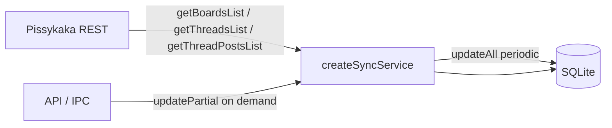

# Remove Kafka + dead event sync

## Target architecture

Sync loop after change: initial `updateAll` (unless `--no-full-sync`) → `sleep(FULL_SYNC_INTERVAL_SECONDS)` → `updateAll` → repeat. No tick, no Kafka, no `DELAY_AFTER_UPDATE_TICK`.

## Out of scope (explicit)

- No new DB migrations; leave [`1700000000001-KafkaFilePassportBoardPost.ts`](packages/backend/src/db/migrations/1700000000001-KafkaFilePassportBoardPost.ts) as-is
- Do not edit `.cursor/plans/*`
- No P2P / multi-source work on `SyncSource`

---

## 1. Delete Kafka runtime

Delete entire tree [`packages/backend/src/kafka/`](packages/backend/src/kafka/) (consumer, handlers, types, index).

In [`packages/backend/src/app/roles.ts`](packages/backend/src/app/roles.ts):
- Remove `runKafka`, `noKafkaConsumer`, kafka config imports
- Stop calling `runKafka` from `runMonolith`

In [`packages/backend/src/cluster.ts`](packages/backend/src/cluster.ts) / [`packages/backend/src/index.ts`](packages/backend/src/index.ts):
- Remove `--no-kafka-consumer` parsing and help text
- Drop `runKafka` call from cluster primary

Deps/config:
- Remove `kafkajs` from [`packages/backend/package.json`](packages/backend/package.json); refresh lockfile via `pnpm install`
- Remove all `KAFKA_*` exports from [`packages/backend/src/utils/config.ts`](packages/backend/src/utils/config.ts)
- Strip Kafka block from [`packages/backend/.env.example`](packages/backend/.env.example)

## 2. Delete event tick-sync

Delete:
- [`packages/backend/src/sync/processors/processEvents.ts`](packages/backend/src/sync/processors/processEvents.ts)
- [`packages/backend/src/types/responseEventsList.ts`](packages/backend/src/types/responseEventsList.ts)

[`SyncSource`](packages/backend/src/sources/types.ts): remove `getEvents`; drop Kafka comment; keep the three REST methods.

[`createRestSource`](packages/backend/src/sources/rest.ts): remove `/v2/event` implementation and related imports.

## 3. Rename sync service + simplify loop

Rename file/API:
- `createUpdateTick.ts` → `createSyncService.ts`
- `createUpdateTick` → `createSyncService`
- `CreateUpdateTickReturn` → `CreateSyncServiceReturn` (or `SyncService`)
- Export from [`packages/backend/src/sync/index.ts`](packages/backend/src/sync/index.ts)

`createSyncService` returns only `{ updateAll, updatePartial }`:
- Remove `tick`
- Remove `current_timestamp` settings get/create
- Keep existing `updateAll` / `updatePartial` bodies

Rename call sites `tickService` → `syncService`:
- [`roles.ts`](packages/backend/src/app/roles.ts), [`cluster.ts`](packages/backend/src/cluster.ts), [`cluster/ipc.ts`](packages/backend/src/cluster/ipc.ts), [`api/syncOptions.ts`](packages/backend/src/api/syncOptions.ts), [`api/routes/util.ts`](packages/backend/src/api/routes/util.ts) (also delete commented `tick()` line)

Rewrite `runSyncLoop` in [`roles.ts`](packages/backend/src/app/roles.ts):
- Flags: only `noFullSync` (drop `noTickSync`)
- If `noFullSync`: log and return (process stays up via API listen / cluster workers)
- Else: initial `updateAll`, then `while (true) { await sleep(fullSyncIntervalMs); await updateAll(); }` with try/catch around sync body
- Remove `delayAfterUpdateTick` usage

Config/scripts:
- Remove `delayAfterUpdateTick` / `DELAY_AFTER_UPDATE_TICK` from config + `.env.example`
- [`package.json`](packages/backend/package.json): `start:cluster` → plain `dist/cluster.js` (no `--no-tick-sync` / `--no-kafka-consumer`); delete `start:no-tick-sync`; `dev` runs without `--no-tick-sync`
- Help text in `index.ts` / `cluster.ts`: drop tick/kafka flags; keep `--no-full-sync`, `--no-api-server`, etc.

## 4. Dead Kafka DB code (no schema migration)

Remove from TypeORM registration and facade:
- Entities [`File.ts`](packages/backend/src/db/entities/File.ts), [`Passport.ts`](packages/backend/src/db/entities/Passport.ts)
- Repos [`files.ts`](packages/backend/src/db/repositories/files.ts), [`passports.ts`](packages/backend/src/db/repositories/passports.ts)
- From [`dataSource.ts`](packages/backend/src/db/dataSource.ts) entities array
- From [`connection.ts`](packages/backend/src/db/connection.ts): `files` / `passports`

Strip Kafka-only helpers:
- Delete [`hashTagToId.ts`](packages/backend/src/utils/hashTagToId.ts)
- Remove `upsertFromKafka` from [`boards.ts`](packages/backend/src/db/repositories/boards.ts) and [`posts.ts`](packages/backend/src/db/repositories/posts.ts)
- Remove `Board.legal` and `Post.legacyId` from entity classes (columns remain in SQLite; `synchronize: false`)

Keep: `Board.tag` unique (via existing migration), `findByTag`, nullable `Post.boardId`.

## 5. Infra + docs

Delete directory [`infra/kafka-ui/`](infra/kafka-ui/) entirely.

Clean Kafka mentions:
- [`infra/monorepo-docker/.env.example`](infra/monorepo-docker/.env.example) — remove `KAFKA_*` / `KAFKA_UI_PORT`
- [`infra/monorepo-docker/README.md`](infra/monorepo-docker/README.md) — remove kafka-ui profile section
- [`infra/monorepo-docker/Dockerfile.dockerignore`](infra/monorepo-docker/Dockerfile.dockerignore) — remove `infra/kafka-ui/.env` line

Update docs to match new sync model:
- [`packages/backend/README.md`](packages/backend/README.md)
- Root [`README.md`](README.md)

Describe: full sync + `FULL_SYNC_INTERVAL_SECONDS` + `updatePartial`; no tick/Kafka/DELAY_AFTER.

## 6. Verify

- `pnpm --filter epds build` (or backend `tsc`) succeeds with no leftover kafka/tick imports
- `rg -i kafka` in repo (excluding `.cursor/plans` and the historical migration filename/comments) shows nothing runtime-related
- Smoke: `dev` / `start:cluster` start without the removed flags
